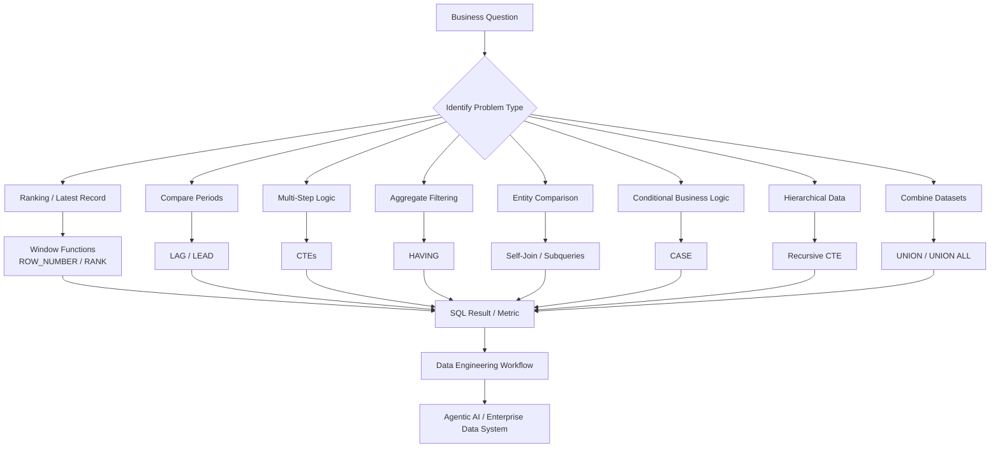
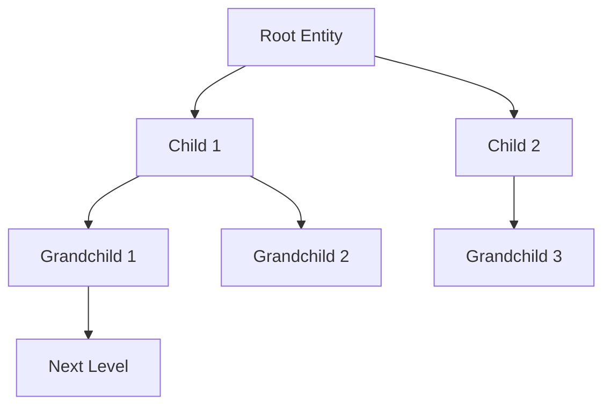

# SQL Patterns

A comprehensive collection of **intermediate to advanced SQL patterns** used in data engineering and Forward-Deployed Engineering (FDE) work, particularly when building and supporting **Agentic AI systems**.

The focus is not just on SQL syntax, but on recognizing the right SQL pattern for a business problem.

---

## Patterns included

1. **Window Functions** — `ROW_NUMBER`, `RANK`, `LAG`, `LEAD`, running totals
2. **Common Table Expressions (CTEs)** — multi-step queries with readable logic
3. **Aggregation with HAVING** — filtering groups based on aggregated conditions
4. **Subqueries** — scalar and correlated subqueries
5. **UNION / UNION ALL** — combining result sets
6. **Self-join** — comparing a table to itself
7. **CASE statements** — conditional logic in SQL
8. **Date filtering** — `BETWEEN`, date functions
9. **GROUP BY with multiple aggregations** — rich summaries
10. **Recursive CTEs** — hierarchical data and sequences

---

## Data Flow

The core idea is:

**Business question → SQL pattern → result / metric → data engineering workflow → Agentic AI system**



This framing is useful for FDE work because the goal is usually not **"write SQL"** in isolation. The goal is:

> **Understand the business question, select the appropriate data pattern, and produce a correct and explainable result.**

---

## Pattern-to-problem map

| Business problem | SQL pattern | Typical use case |
|---|---|---|
| Rank entities | Window functions | Customer ranking, top-N analysis |
| Find latest record | `ROW_NUMBER` | Latest transaction / status |
| Compare periods | `LAG` / `LEAD` | Month-over-month or year-over-year changes |
| Build multi-step logic | CTEs | Complex analytical workflows |
| Filter aggregated results | `HAVING` | Customers exceeding thresholds |
| Dynamic filtering | Subqueries | Compare against calculated values |
| Compare entities | Self-join | Employee / manager, account comparisons |
| Apply business rules | `CASE` | Segmentation and classification |
| Analyze time periods | Date filtering | Cohorts, retention, reporting windows |
| Combine datasets | `UNION` / `UNION ALL` | Multiple event or source streams |
| Hierarchical data | Recursive CTE | Organization trees, dependencies |

---

## 1. Window Functions

Window functions calculate values across related rows **without collapsing the result set**.

Common patterns:

```sql
ROW_NUMBER()
RANK()
LAG()
LEAD()
SUM() OVER (...)
```

### Typical FDE use cases

- Ranking customers
- Finding the latest record per entity
- Running totals
- Period-over-period comparisons
- Time-series analysis

### Example mental model

```text
Rows
 │
 ├── Partition
 │
 ├── Order
 │
 └── Calculate across related rows
          │
          ▼
     Window Function
          │
          ▼
     Enriched Result
```

---

## 2. Common Table Expressions (CTEs)

CTEs break complex SQL into named, readable steps.

```text
Raw Data
   ↓
CTE 1
   ↓
CTE 2
   ↓
CTE 3
   ↓
Final Result
```

### Typical FDE use cases

- Multi-step transformations
- Complex business logic
- Analytical pipelines
- Improving query readability
- Building intermediate datasets

The key benefit is that each logical operation becomes easier to understand and test.

---

## 3. Aggregation with HAVING

`WHERE` filters rows **before aggregation**.

`HAVING` filters groups **after aggregation**.

```text
Rows
  │
  ▼
WHERE
  │
  ▼
GROUP BY
  │
  ▼
Aggregate
  │
  ▼
HAVING
  │
  ▼
Result
```

This distinction is important when implementing business rules such as:

> "Find customers whose total revenue exceeds $1M."

---

## 4. Subqueries

Subqueries allow one query to use the result of another query.

They can be:

- Scalar subqueries
- Non-correlated subqueries
- Correlated subqueries

### Typical use cases

- Dynamic filtering
- Comparing values against calculated metrics
- Existence checks
- Building reusable query logic

---

## 5. UNION / UNION ALL

Both operators combine result sets.

The important distinction:

```text
UNION
  → combines + removes duplicates

UNION ALL
  → combines + preserves duplicates
```

`UNION ALL` is often preferable when deduplication is unnecessary because it avoids the additional work of removing duplicates.

---

## 6. Self-Join

A self-join joins a table to itself.

For example:

```text
Employee
   │
   ├── Employee ID
   └── Manager ID
           │
           ▼
       Employee
```

### Typical FDE use cases

- Organizational hierarchies
- Parent / child relationships
- Comparing records within the same entity
- Detecting relationships between rows

---

## 7. CASE Statements

`CASE` implements conditional business logic inside SQL.

Conceptually:

```text
Value
  │
  ▼
Condition?
 ├── Yes → Category A
 └── No  → Category B
```

### Typical use cases

- Customer segmentation
- Risk classification
- Business rules
- Status mapping
- Conditional metrics

---

## 8. Date Filtering

Date filtering is fundamental to analytical workloads.

Common techniques include:

```sql
BETWEEN
DATE()
strftime()
date arithmetic
```

### Typical FDE use cases

- Reporting windows
- Retention analysis
- Cohort analysis
- Time-series metrics
- Period comparisons

A common production consideration is being explicit about:

- Time zones
- Inclusive vs. exclusive boundaries
- Date vs. timestamp semantics

---

## 9. GROUP BY with Multiple Aggregations

Multiple aggregations can produce rich business summaries.

For example:

```text
Customer
   │
   ├── COUNT(transactions)
   ├── SUM(revenue)
   ├── AVG(transaction_value)
   ├── MIN(transaction_date)
   └── MAX(transaction_date)
```

### Typical use cases

- Customer analytics
- Financial reporting
- Operational dashboards
- Business KPIs

---

## 10. Recursive CTEs

Recursive CTEs are useful when data contains hierarchical or graph-like relationships.



### Typical FDE use cases

- Organizational structures
- Parent / child relationships
- Dependency trees
- Category hierarchies
- Graph-like traversal

---

## How these patterns support Agentic AI

SQL is increasingly a tool used by AI agents rather than only by humans.

A simplified Agentic AI data workflow can look like:

```mermaid
flowchart LR
    A["User Business Question"] --> B["AI Agent"]

    B --> C["Understand Intent"]
    C --> D["Identify Entities / Metrics"]
    D --> E["Select SQL Pattern"]
    E --> F["Generate SQL"]
    F --> G["Execute Query"]
    G --> H["Validate Result"]
    H --> I["Explain Result"]

    I --> J["Business Answer"]
```



For example:

> **"Which customers increased their revenue compared with the previous quarter?"**

An agent may need:

1. Identify the customer and revenue entities
2. Group revenue by customer and period
3. Use `LAG()` to obtain the previous period
4. Calculate the delta
5. Filter positive changes
6. Return the result

The SQL pattern is therefore part of the agent's **reasoning/tool execution process**.

---

## SQL patterns in an FDE workflow

In a Forward-Deployed Engineering environment, SQL often sits between business requirements and production AI systems.

```text
Customer Requirement
        │
        ▼
Understand Business Semantics
        │
        ▼
Identify Data Sources
        │
        ▼
Select SQL Pattern
        │
        ▼
Generate / Write Query
        │
        ▼
Validate Result
        │
        ▼
Integrate into Application / Agent
```

This is why intermediate and advanced SQL remains important even when an AI system can generate SQL automatically.

An FDE still needs to determine whether the generated query is:

- Correct
- Semantically appropriate
- Efficient enough
- Consistent with business definitions
- Safe to execute

---

## How to use

All queries are written in **SQLite** for portability. No external database is required.

Run the complete SQL file directly:

```bash
sqlite3 < sql_patterns.sql
```

Or open `sql_patterns.sql` in your favorite SQL editor and execute queries individually.

---

## Key Pointers

- **"Window functions are essential for time-series, ranking, and latest-record problems."**
- **"CTEs make complex queries readable and maintainable by separating business logic into steps."**
- **"I distinguish row-level filtering with WHERE from aggregate-level filtering with HAVING."**
- **"UNION removes duplicates, while UNION ALL preserves them — the choice should be deliberate."**
- **"Self-joins are useful when relationships exist within the same entity type."**
- **"Recursive CTEs are useful for hierarchical and dependency data."**
- **"When working with AI-generated SQL, I validate the semantics of the query rather than assuming syntactic correctness means business correctness."**

---

## Why these patterns matter

At the data engineering / FDE level, these patterns appear constantly:

- **Window functions** — rankings, running totals, latest records, time-series metrics
- **CTEs** — breaking complex business logic into readable steps
- **Subqueries** — dynamic filtering and calculated comparisons
- **Date filtering** — time-series analysis and retention cohorts
- **GROUP BY / HAVING** — business summaries and threshold-based analysis
- **CASE** — business rules and segmentation
- **UNION / UNION ALL** — combining data from multiple sources
- **Self-joins** — relationships within the same dataset
- **Recursive CTEs** — organizational and hierarchical structures

---

## Design philosophy

The objective of this repository is not to memorize SQL syntax.

It is to develop the ability to answer:

> **"Given this business problem and this data model, which SQL pattern should I use?"**

That skill becomes especially valuable in Agentic AI systems, where an AI agent may generate the SQL but an engineer still needs to understand, validate, debug, and productionize the resulting query.

### Core idea

> **Business problem → Data semantics → SQL pattern → Correct result → AI / data workflow**
